# RYDAPLink
RYDAPLink —— 集`下载`、`调试`、`串口`、`3.3V/5V 供电`、`串口 ISP`功能于一身的 DAPLink 下载器，, 由 RYMCU 社区 ( https://rymcu.com ) 倾情打造。

## 1.背景

在开发 STM32 等基于 arm 内核的单片机时，几乎所有人都会遇到同一个问题。[那就是选择一款什么样的下载调试器呢？](https://rymcu.com/article/22)市面上有各式各样的下载调试器可供我们选择，我觉得选择一款最合适自己的，才是重要的。常用的下载器包括 J-Link，ST-Link，J-Link0B，CMSIS-DAP，DAPLink 等。

当接触到 DAPLink 这个方案后，我们根据官方开源的原理图，设计了一版下载调试并且开始了一段时间的试用。实物非常的小巧，尺寸为：50mm x 50mm，实物长下面这样了。

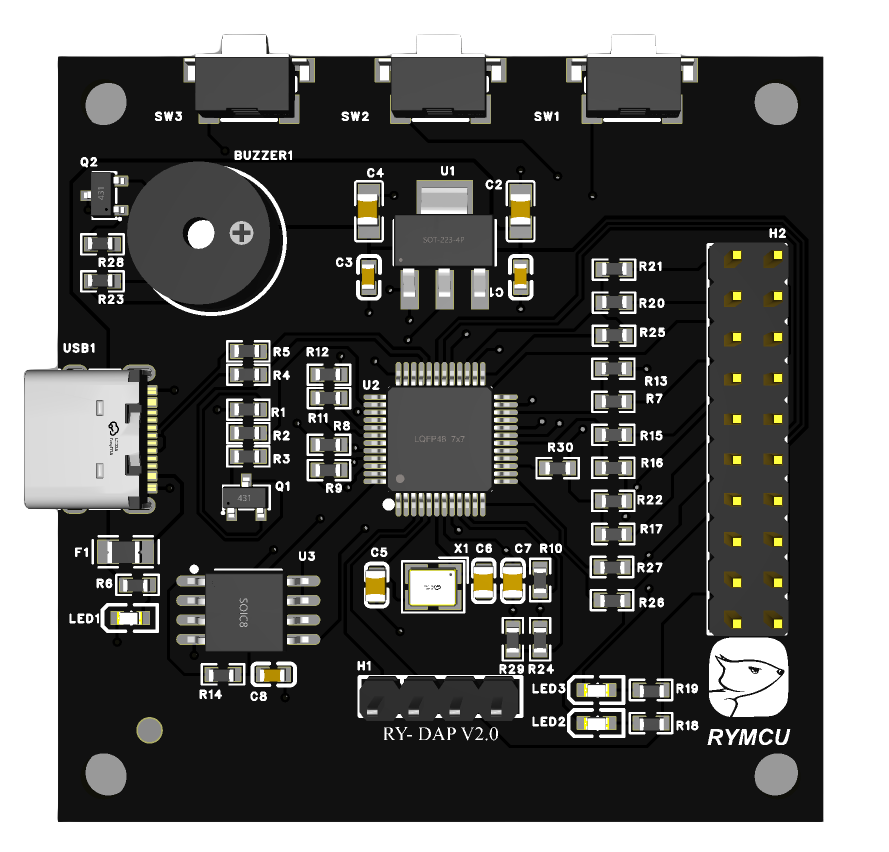  

同时，我们在源码的基础上进行了一些改进，实现了串口 ISP 功能。另外，原来方案的基础上，增加了板载自恢复保险丝，保证即使短路也不会烧坏主板，这样心里踏实多了。项目经过了长时间的使用测试，固件非常稳定。**五合一功能：下载、调试、串口、3.3V/5V供电，串口ISP。**

**本文基于ARMmebed官方开源代码打造了一款 DAPLink 下载调试器，并做了些许改进，无论初学与否，跟随下面教程，你也可以打造属于你自己的 DAPLink!**

## 2. DAPLink项目简介及使用方法

### 2.1 功能介绍

这是一款ARM官方开源的仿真器，可以实现全系列 Cortex-M0/M3/M4/M7 内核芯片的程序下载和调试。特性如下：

- **a.官方开源，无版权限制，稳定不丢失固件**
- **b.SWD接口，全系列Cortex-M0/M3/M4/M7下载和调试（HID）**
- **c.自带USB虚拟串口，方便程序调试（CDC）**
- **d.拖拽下载功能，模拟U盘，将Hex或bin格式文件拖拽或拷贝至U盘完成下载(MSC)**
- **e.串口下载程序，改进官方程序实现（串口ISP）**
- **f.输出5.0V电源，可供电目标电路**
- **g.输出3.3V电源，可供电目标器件**
- **h.板载自恢复保险丝，短路自保护**
- **i.Win10即插即用，无需驱动**

### 2.2 接口及尺寸

产品上下共计8个插针，其中上面四个插针为下载调试接口，下面四个插针为串口通讯接口。具体引脚如下所示：

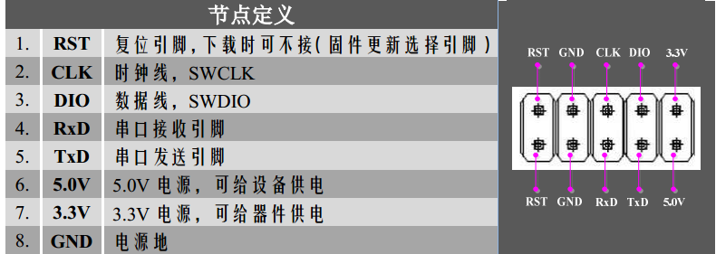  

DAPLink与单片机的连接关系：

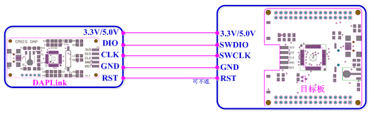  

产品上下共计8个插针以STM32F103xx单片机为例：DIO对应PA13，CLK对应PA14，RST对应NRST（可不连接）。3.3V或5V供电可根据时许需要选择。

### 2.3开发环境

DAPLink由CMSIS-DAP发展而来，因此，但凡支持CMSIS-DAP协议的开发环境都可用来下载或调试程序，包括不仅限于下列IDE软件：

- **1. MDK Keil**
- **2. IAR**

### 2.4通过Keil下载程序的配置

首先将DAPLink插入PC的USB口，显示如下图所示：

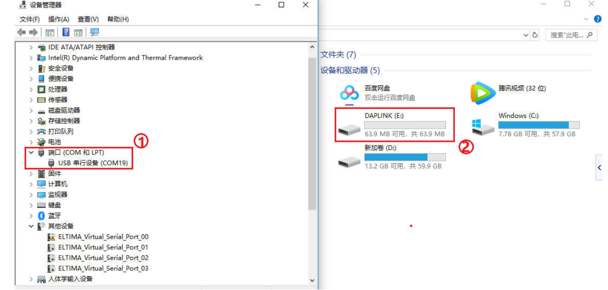

- 1.如果识别成功，在设备管理器中会生成一个串口①`USB串行设备(comX)`,每个电脑显示的数字会不一样，我这显示的是`com19`, 记住这个数字即可；
- 2.”我的电脑“目录下将生成②名称为`DAPLINK(E:)`的U盘；
- 3.如果没出现上述现象，请重新插拔DAPLink。
  注意：win7或win8操作系统需要安装串口驱动，资料包中包含驱动，或至[官网下载](http://os.mbed.com/media/downloads/drivers/mbedWinSerial_16466.exe)
  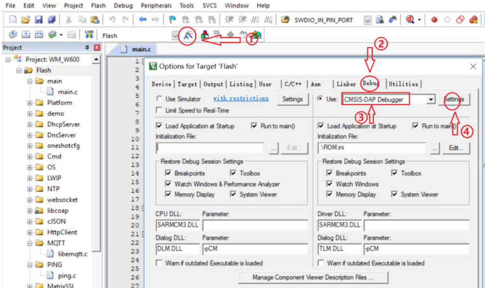
- 4.打开keil5软件，点击如上图所示的①配置选项，进入`Options fo Target ‘Flash’`选项；
- 5.在②所示的`Debug`子菜单下，`use:`下拉菜单③选择`CMSIS-DAP Debugger`;
- 6.点击④的`Setting`，进入下一步设置；
  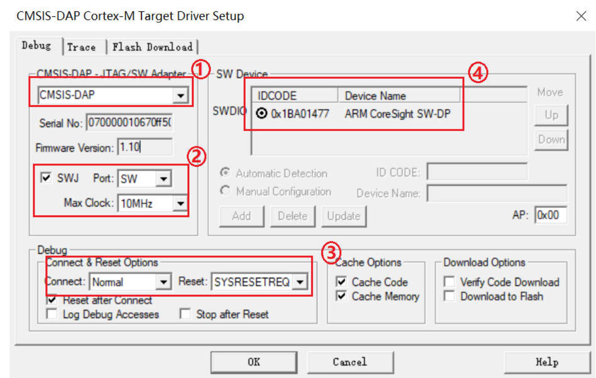
- 7.在上图`Debug`子菜单下按图中①、②、③进行配置，最大速度为10MHz；
- 8.DAPLINK与目标板连接好之后，将会显示④器件信息；
- 9.如果没有显示④，请重现连接DAPLINK与目标板，并返回第6步重新设置；
- 10.切换到`Flash Download`录下，如下图所示；
  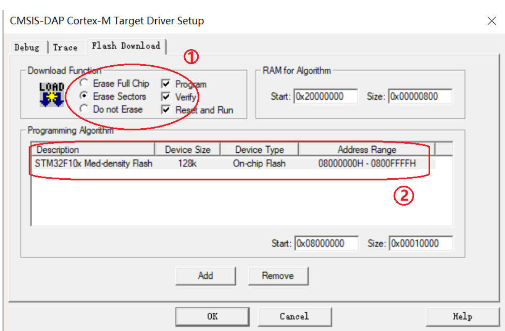
- 11. 按照上图①、②进行设置；
- 12.其中②需根据单片机具体型号进行选择，点击`add`或`Remove`进行添加或删除；
- 13.接着点击所有`OK`完成设置；
- 14.编译好工程之后，点击下图所示的`LOAD`，开始程序下载；
  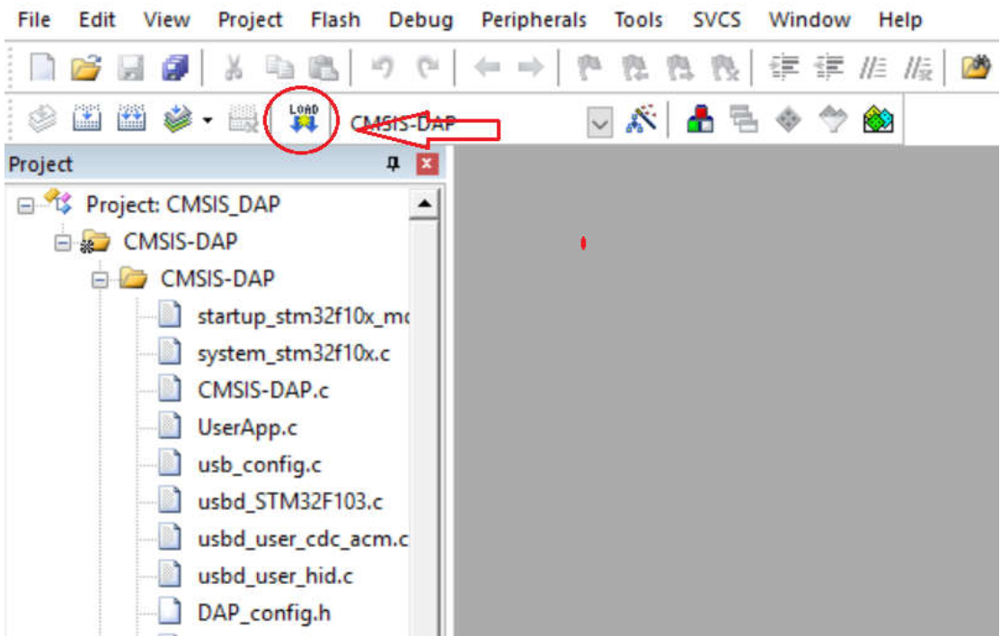
- 15.上述配置一次永久有效，下次下载时只需**点击`LOAD`即可。**

### 2.5串口下载配置

DAPLINK的官方源码并不支持串口下载程序功能，我们对程序稍微做了些改进，增加了串口下载功能，平时也可以作为普通串口使用。串口电路连接图如下所示：

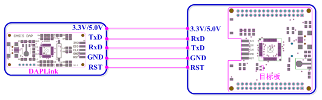

其中，`TxD--->RxD，RxD<---TxD`，以STM32F103xx为例，DAPLink的TxD对应PA10，RxD对应PA9。

- 1.启动单片机串口下载软件mcuisp.exe；
- 2.如下图①配置串口端口和波特率，端口号为前面识别的DAPLINK串口号，波特率可以任选，我这里以460800bps为例；
- 3.如下图②所示选择需要下载的HEX文件；
- 4.如下图③选择`不使用RTS和DTR`；
  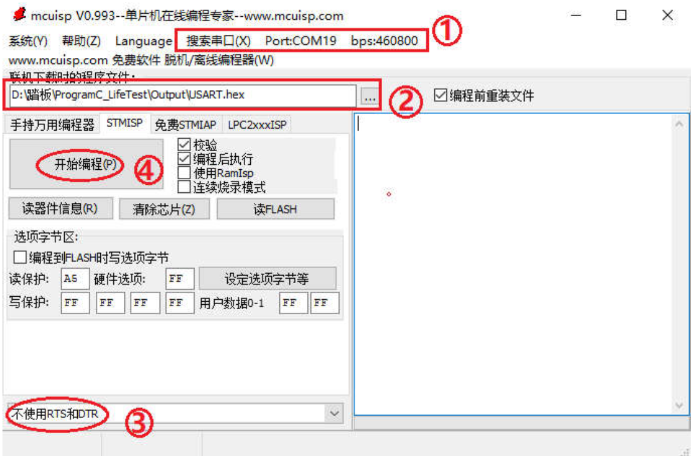
- 5.确保DAPLink与目标板串口已经连接好，并且配置好BOOT0,1的值，以STM系列单片机为例：设置`BOOT0=1，BOOT1=0`；
- 6.点击上图所示的④`开始编程(P)`，随后按下目标板的复位按键；
- 7.如下图所示，显示下载程序信息，表示下载成功。
  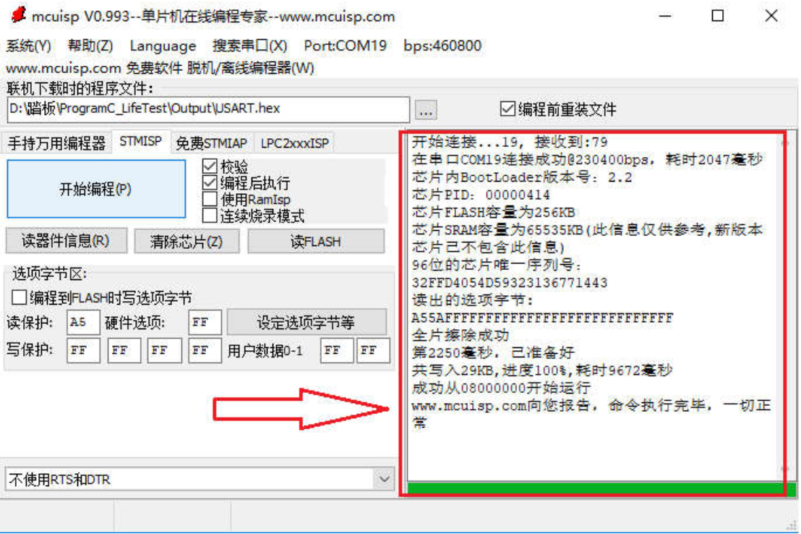

### 2.6 拖拽下载配置

DAPLINK的拖拽下载功能，是指只需要将编译好的.Hex或.Bin文件拖拽至DAPLINK的U盘便可完成下载。正常情况下，DAPLINK的U盘中将包含下图所示的两个文件：

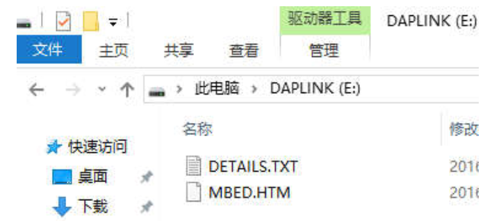

如果拖拽下载成功，下载成功的详细信息可以在DETAILS.TXT文件查询。如果下载不成功，U盘目录下将生成FAIL.TXT文件，  在文件中可以查看下载失败的具体原因。

但是，U盘拖拽下载功能有所限制，一种固件只能对应一系列单片机。例如，我们这款产品出厂时烧录的是STM32F103xx系列的固件，因此，只支持STM32F103xx系列单片机拖拽下载。如果你想要拖拽下载STM32F401xx系列单片机程序，则必须将固件更新为STM32F401xx的固件。产品资料包中包含了官方支持的几种固件。固件更新方法详见下一节内容。

### 2.7 固件更新办法

- 1.使用跳线冒或者镊子等工具将RST和GND之间短路，并将DAPLINK插入PC，生成的U盘名称将变为MAINTENANCE(E:)，如下图所示：
  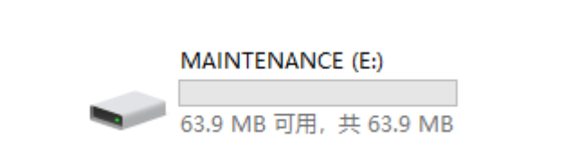
- 2.出现了上述U盘之后，将跳线帽断开，即保证RST和GND处于断开状态；
- 3.将对应系列单片机的`.bin`格式固件拖拽至U盘，完成更新；
- 4.如果下载成功，将DAPLink重新拔插一下便可正常使用了。

#### 注意事项：

固件一定要是名称中包含CRC的跳线帽断开，即保证RST和GND处于断开状态；

- 3.将对应系列单片机的`.bin`格式的文件，如果DAPLIN的bootloader文件损坏了，我们需要使用其他的下载器先将bootloader文件下载至DAPLink中，再按照上面的方法更新固件。DAPLink自身的下载口在设备的侧面，打开源代码文件夹stm32f103xb_bl的bootloader工程，并通过keil5软件将其下载至模块中。
  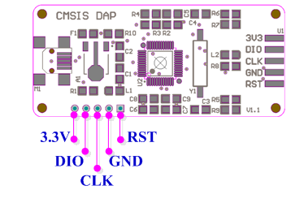

## 3. DAPLink官方源码编译方法

对于喜欢DIY的朋友来说，使用官方源码来定制个性化的DAPLINK将会是一件乐趣无穷的事情。小编经过一段时间的摸索，熟悉了源码编译的流程，即使是初学者，按照这套流程也能快速的将程序跑起来，为了让大家在学习，开发的过程中少走些弯路，将它们在这里分享给大家。

### Step1工具软件安装

包括下面这些必备的软件，软件包含在资料包中，也可以自己网上下载：

- 1.python2.7
- 2.Git
- 3.MDK5.25
- 4.pip  
  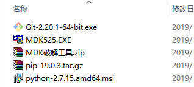

#### 软件安装注意事项：

- 1.首先Python请安装版本2.7，其他版本可用性小编还没有测试；
- 2.安装好python之后，请注意添加环境变量，方法如下图所示；
  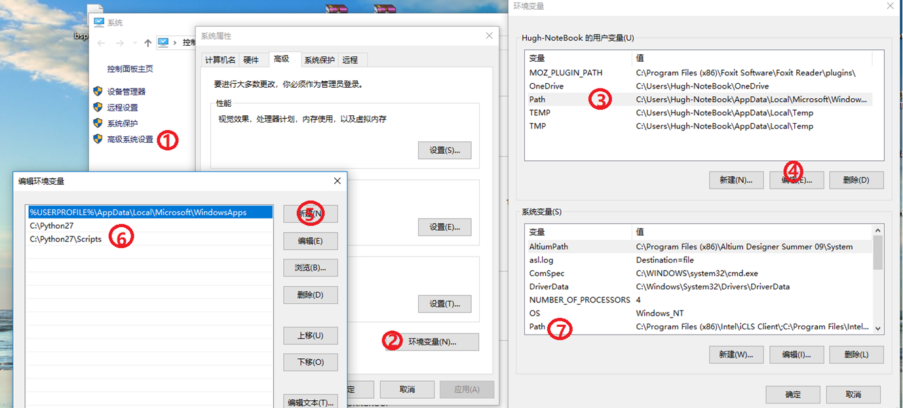
- 3.安装好python后记得安装pip；
- 4.安装好MDK5.25。

### Step2源码下载

官方源码可以从github仓库下载，官方一直在维护和更新，下载地址如下：
[https://github.com/ARMmbed/DAPLink](https://github.com/ARMmbed/DAPLink)。下载后，将文件解压，记住文件路径不要包含中文字符，解压后源码目录如下图所示：

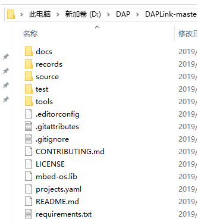

### Step3建立编译环境

在源码目录下运行git bash,如下图所示，在右键菜单中选择“Git Bash Here”:

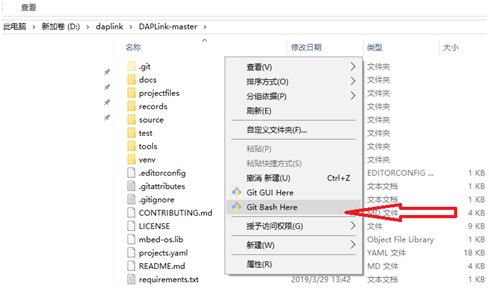

**1.在git输入以下代码建立初始运行环境**

```
pip install future
pip install virtualenv
virtualenv venv
```

**2.在git输入以下代码生成工程文件**

```
venv/Scripts/activate.bat
pip instll –r requirements.txt
progen generate –t uvision
venv/Scripts/deactivate.bat
```

**3在git输入以下代码初始化仓库，并提交代码至本地仓库**

```
git init
git add .
git config --global user.name "hugh"
git config --global user.email "hugh@163.com"                                
git commit -m "layout"
```

注意：上述代码必须逐条执行，需等上一条执行完毕，再执行下一条，上述代码代码执行需要连接互联网，执行过程需要一点时间，务必耐性等待。

### Step4编译以及DIY

按照上述操作过后，在源码目录的Projectfiles文件夹下将分别生成bootloader工程和固件工程。

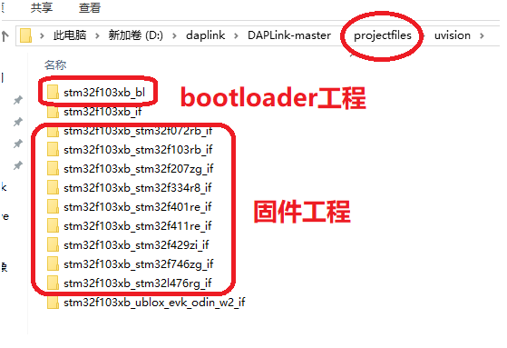

我们打开其中一个固件工程进行编译，如果step3各部分操作无误，编译结果将如下图所示。

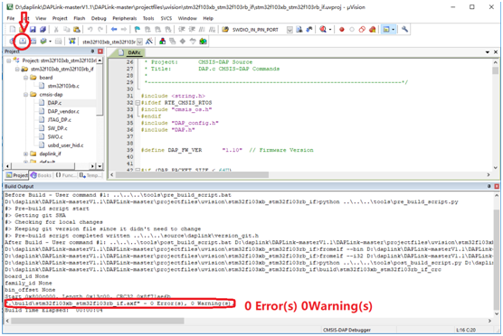

到目前为止，便可以根据你自己的想法进行DIY了。DAPLink的功能详细介绍和使用方法可以参考百度网盘文档：
> 链接：[https://pan.baidu.com/s/1UrB2PPemmqqJzdAdFapPbA](https://pan.baidu.com/s/1UrB2PPemmqqJzdAdFapPbA)  
> 提取码：x25j

电路板PCB工程开源如下，注意该工程本来是要设计离线DAP用的，中途项目暂缓，先将PCB工程开源出来（电路板验证过），DIY玩家可以自己行打样，移植的时候需要自行根据原理图结合程序更改IO口配置。

> 工程下载链接：[RYDAPLink.epro](./pcb/1706016115353.epro)  
> 原理图:  
> 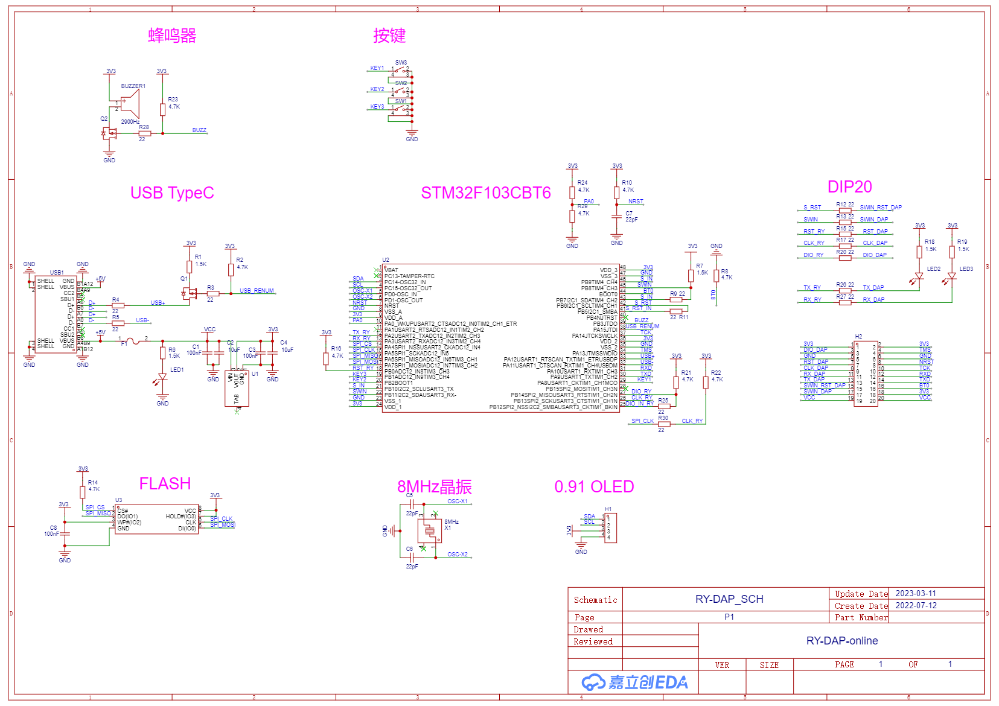

注意使用[立创 EDA](https://pro.lceda.cn/) 专业版导入工程即可使用。
